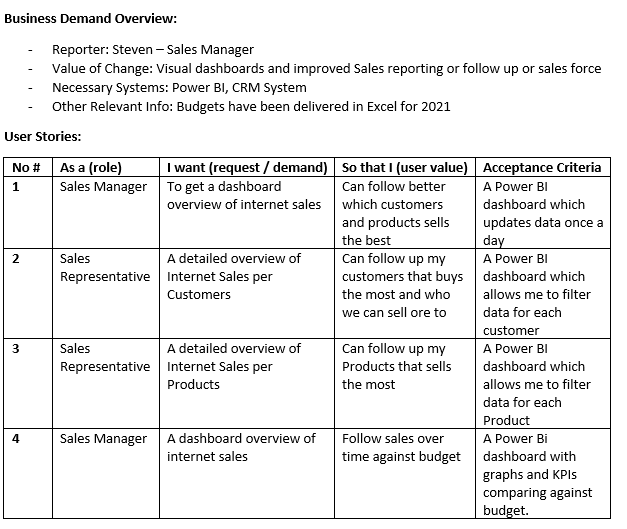

# Project using SQL + Power BI 

Dashboard creaed to analylize Data
Source:
Adventureworks SQL data set

First Step , 

Define bussines requirement,

Second step, 

Extract tables with SQL

Then, export results to csv 

Third Step, 

Build Data Model With Power BI

Fourth Step, 

Dashboard built

