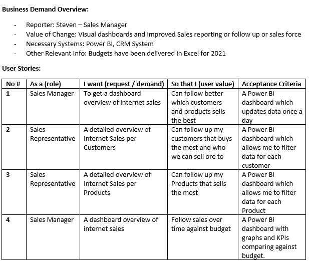
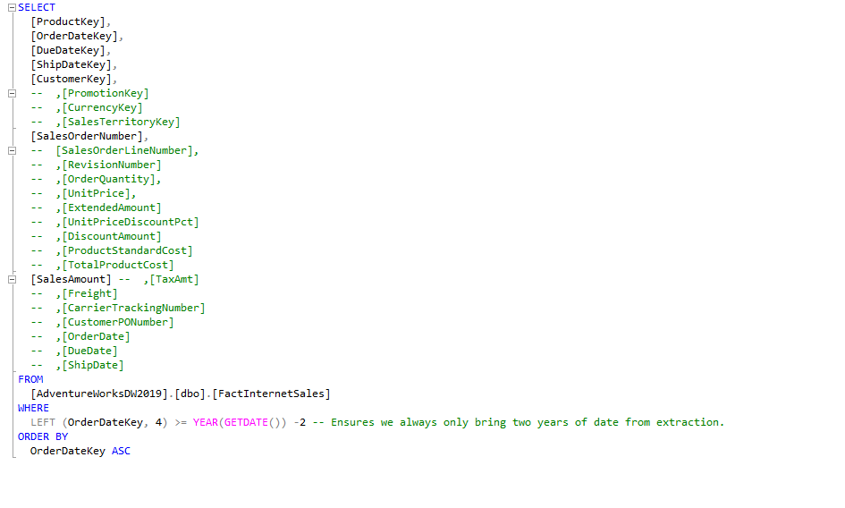
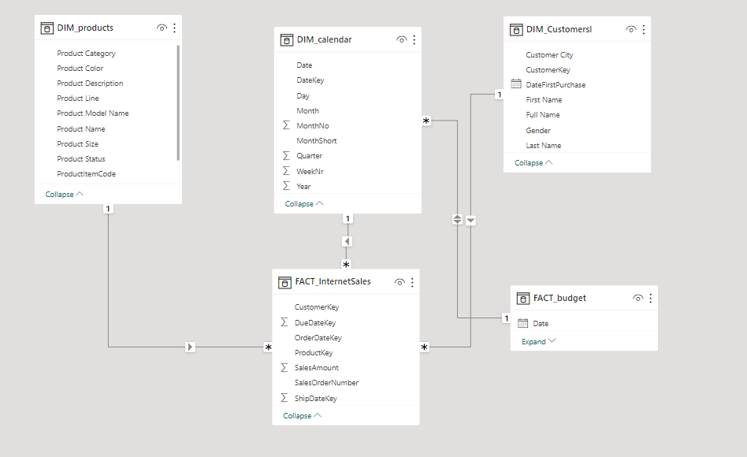
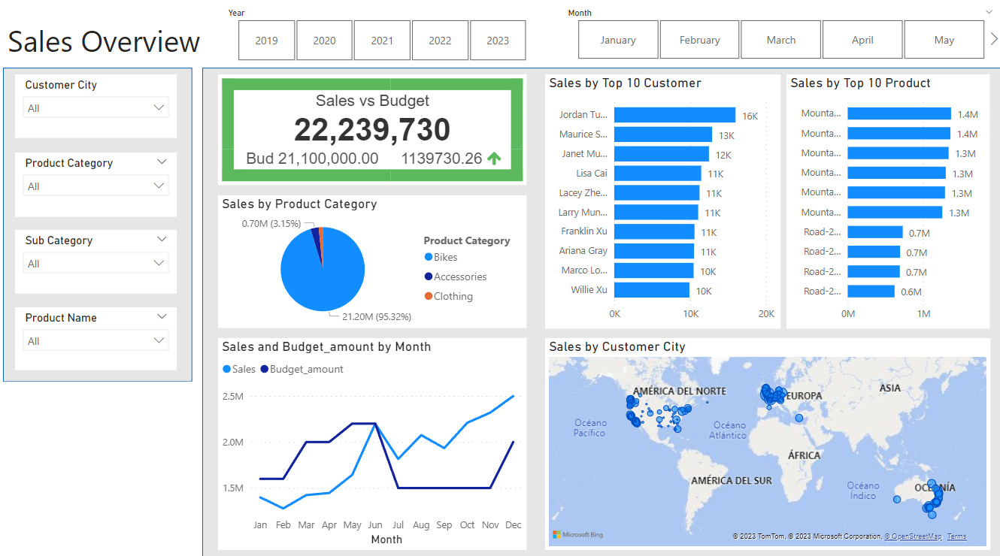
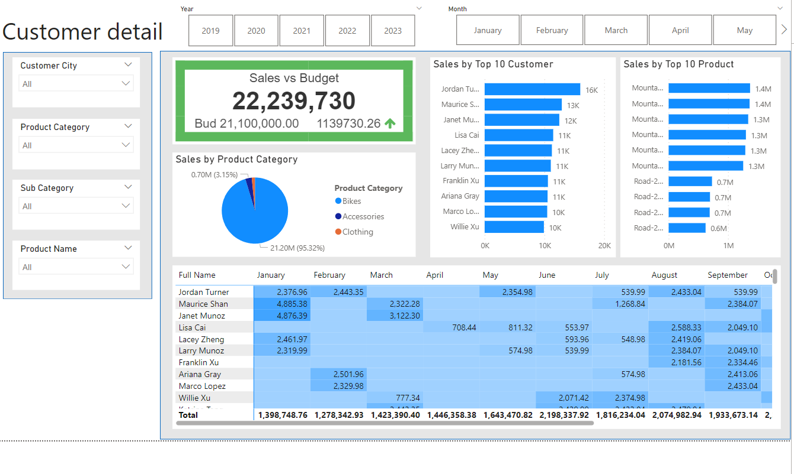

# End-to-End Sales Intelligence Dashboard | SQL + Power BI

## 📌 Project Overview

This project demonstrates a complete Business Intelligence workflow — from business requirements definition to SQL data extraction, data modeling, and executive dashboard development using Power BI.

The objective was to transform raw transactional sales data from the AdventureWorks SQL dataset into a structured analytics solution for Sales Management decision-making.

---

## 🏢 Business Context

**Data Source:** AdventureWorks SQL Dataset  
**Stakeholder:** Sales Manager  
**Objective:** Improve visibility into sales performance, customer behavior, and budget tracking.

The organization was relying on static Excel-based reports. The goal was to build a dynamic, interactive BI solution that enables real-time performance analysis and better strategic decisions.

---

# Step 1 — Business Requirements Definition

Defined stakeholder needs and translated them into measurable analytical outputs.

Key business questions:

- How are internet sales performing over time?
- Are we achieving budget targets?
- Which customers generate the most revenue?
- Which product categories drive the highest sales?
- What are the monthly and yearly sales trends?

Business requirements were structured before any technical development.

---

# Step 2 — Data Extraction with SQL

Extracted and prepared relevant transactional data directly from the AdventureWorks database.

Key actions performed:

- Selected core sales transaction fields
- Structured clean datasets for analytics
- Applied filtering to optimize performance
- Ensured data consistency for BI modeling
- Prepared exports for structured ingestion

SQL was used to ensure the dataset was analysis-ready before visualization.

After extraction, the cleaned datasets were exported into CSV format to be used within Power BI for modeling.

---

# Step 3 — Data Modeling in Power BI

Built a structured star schema model to support scalable analytics.

Model components:

- Fact_InternetSales (central transactional table)
- DIM_Products
- DIM_Customers
- DIM_Calendar
- FACT_Budget

Applied:

- One-to-many relationships
- Primary and foreign key alignment
- Time intelligence structure
- Data normalization best practices

The model was designed to ensure:

- Accurate KPI calculation
- Query performance efficiency
- Scalability for additional metrics

---

# Step 4 — Dashboard Construction

Developed an executive-level interactive dashboard focused on actionable insights.

Key dashboard components:

- Total Sales KPI
- Sales vs Budget comparison
- Sales by Product Category
- Top 10 Customers
- Time-based trend analysis
- Interactive filtering by date, category, and geography

The dashboard enables leadership to:

- Monitor performance in real-time
- Identify high-value customers
- Detect underperforming segments
- Track budget deviations

---

## 📊 Key KPIs Delivered

- Total Revenue
- Budget Achievement %
- Top Customer Revenue Contribution
- Product Category Performance
- Monthly & Yearly Sales Growth
- Revenue per Customer

---

## 💡 Business Impact

This solution demonstrates how structured BI architecture can:

- Replace static Excel reporting
- Improve sales visibility
- Enable proactive performance management
- Support executive-level decision making

---

## 🛠️ Tech Stack

- SQL (Data Extraction & Transformation)
- Power BI (Data Modeling & Visualization)
- DAX (KPI Calculations)
- Dimensional Modeling (Star Schema)
- CSV Data Processing

---

## 🧠 What This Project Demonstrates

- End-to-end BI lifecycle execution
- SQL-based data preparation
- Structured dimensional modeling
- Executive dashboard design
- Business-first analytical thinking
- Clean documentation & communication

---

## 👤 Author

Juan Ojeda  
Business Intelligence & Operations Analyst  

Focused on transforming operational data into decision-ready insights through structured modeling and performance-driven analytics.

