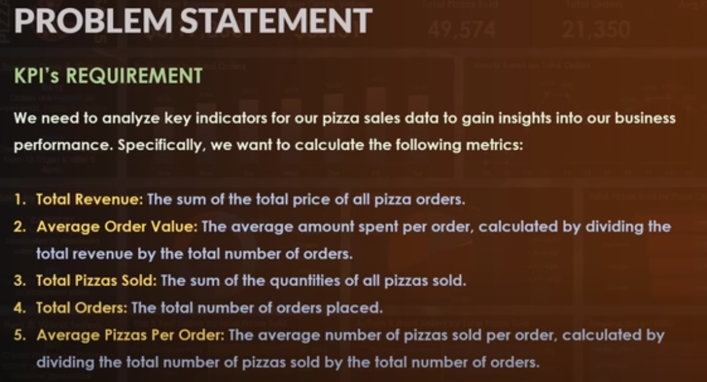
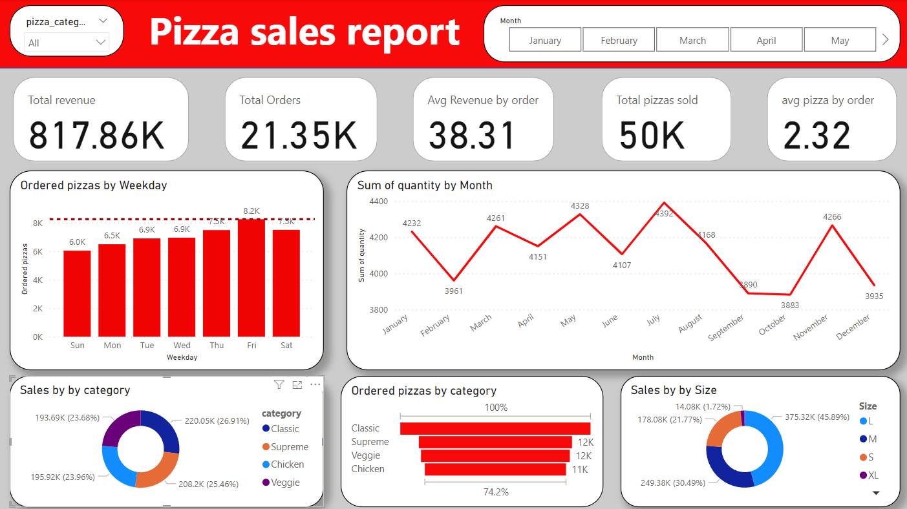

# Project using Python + Power BI 

Dashboard creaed to analylize Data
Source:
Adventureworks SQL data set

First Step , 

Define bussines requirement,

Second step, 

ETL proces with python

Please watch ETL.ipynb file... 

Third Step, 

Dashboard Construction

