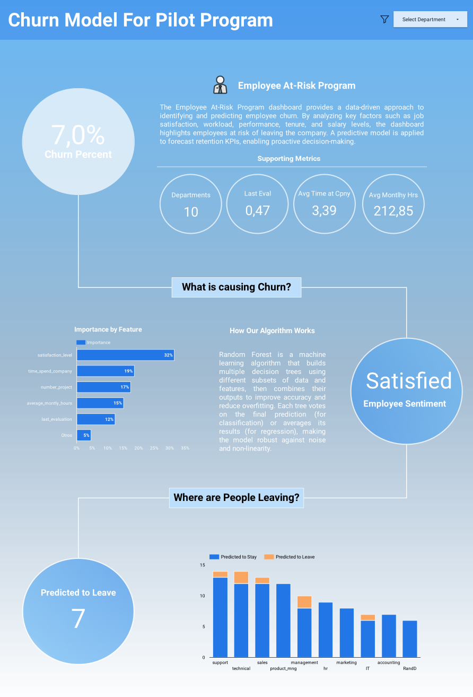

# ⭐ End-to-End Churn Prediction Pipeline  
### Python | BigQuery | Looker Studio | Machine Learning  

> Designed to mirror a real-world enterprise analytics workflow — transforming raw workforce data into predictive insight that supports proactive retention strategies.

---

## 📌 Business Problem

Employee attrition generates operational disruption, knowledge loss, and high replacement costs.  
Organizations often react too late because they lack predictive visibility into workforce risk.

The objective of this project was to anticipate employee churn by building a scalable analytics pipeline capable of identifying at-risk employees before turnover occurs.

---

## 🚀 Solution

Developed an end-to-end churn prediction workflow integrating machine learning, cloud data warehousing, and executive visualization.

This solution enables HR leaders and decision-makers to monitor attrition risk, understand key drivers, and act early to improve retention outcomes.

---

## 📊 Dashboard Preview

---

## 🧠 Business Impact

✔ Enables proactive retention strategies  
✔ Reduces potential recruitment and training costs  
✔ Improves workforce planning  
✔ Supports executive decision-making  
✔ Promotes data-driven HR management  

---

## ⚙️ Tech Stack & Architecture

**Python**  
- Data cleaning  
- Feature engineering  
- Model development  

**Google BigQuery**  
- Cloud-scale data storage  
- Structured analytics  
- High-performance querying  

**Machine Learning**  
- Classification model to predict employee attrition probability  

**Looker Studio**  
- Executive dashboard for churn monitoring  
- Interactive workforce insights  

---

## 🔄 Analytics Workflow

1️⃣ Data ingestion and validation  
2️⃣ Exploratory data analysis to identify attrition drivers  
3️⃣ Feature engineering  
4️⃣ Model training and evaluation  
5️⃣ Data warehousing in BigQuery  
6️⃣ Executive dashboard development  

---

## 🎯 Key Skills Demonstrated

- Predictive Analytics  
- Cloud Data Warehousing  
- End-to-End Pipeline Design  
- Data Modeling  
- Executive Reporting  
- Business-Oriented Analytics  

---

## 💡 Project Positioning

This project reflects how modern data teams leverage machine learning and cloud platforms to transition from reactive reporting to predictive decision-making.

Built with a strong focus on business applicability — not just technical execution.

---

## 🔗 Live Executive Dashboard

👉 https://lookerstudio.google.com/reporting/2f410a5a-8063-464f-bc9c-8fb8f07c5924

