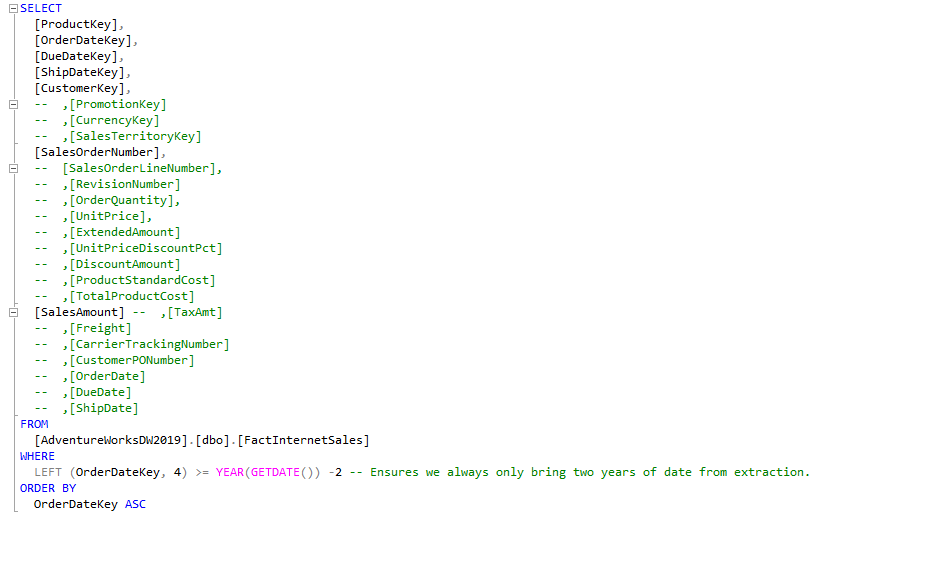
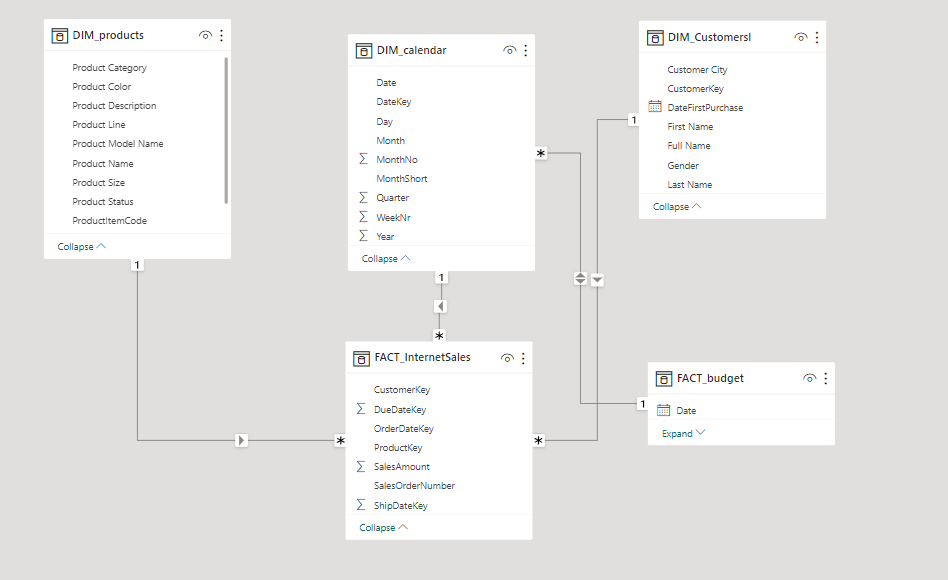
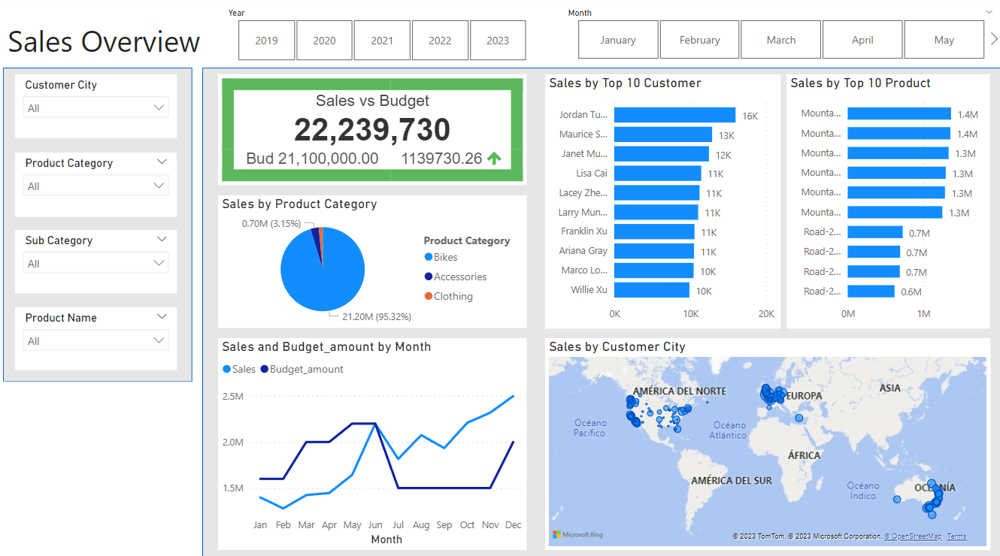

# Proyecto usando SQL + Power BI 

Source:
Adventureworks SQL data set

First Step , 

Definir los requisitos del negocio,

Segundo paso, 

Extraer tablas con SQL,

A continuación, exporte los resultados a csv 

Tercer paso,

Crear un modelo de datos con Power BI

Cuarto paso, 

Construcción del Dashboard

